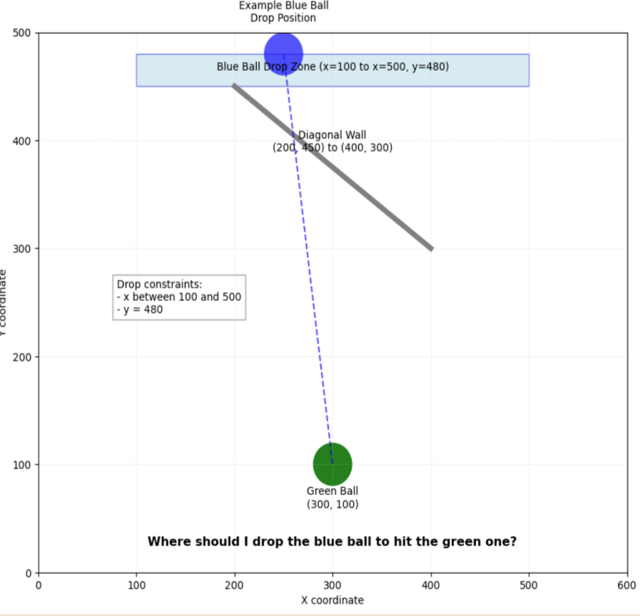

# Clem Physics Puzzle Game Environment

A 2D physics-based puzzle game designed for evaluating Large Language Models (LLMs) on spatial reasoning, multi-turn problem-solving, and adaptive learning. Built on `pymunk` for physics simulation and integrated with the `ClemBench` framework for interactive, multimodal, and multilingual assessment.

---

## 🧩 Project Overview

This project provides a **game-based evaluation environment** where a blue ball is dropped from the top of a 2D play space and must reach a green target ball by navigating obstacles. LLMs or agents must choose optimal drop coordinates and adapt strategies across multiple attempts.

The environment is suitable for:

- Benchmarking LLM spatial reasoning  
- Multimodal (image + text) evaluation  
- Multilingual assessment (English, German, Spanish)  
- Agent learning from feedback  

---

## 🎮 Game Mechanics

- **Objective:** Drop the blue ball so it hits the green target ball at the bottom.  
- **Environment:** 600×600 pixel grid with obstacles of variable position and elasticity.  
- **Dynamic Ball:** Blue, radius 18px, affected by gravity, elasticity 0.7, friction 0.2.  
- **Target Ball:** Green, static, radius 18px; a hit is registered if the distance ≤36px.  
- **Obstacles:** Line segments, static, varying length and position per level; affect ball trajectory.  
- **Levels:** 5 levels with increasing obstacle complexity; 2 games per level.  

---
## Level Design

The level progression system creates increasing difficulty through obstacle quantity.  
Level 1 contains a single obstacle, Level 2 introduces a second, and so on.


---
📝 Experimental Framework

The environment supports multi-turn reasoning and visual language integration:
Text-only mode: Models receive obstacle coordinates and textual descriptions.
Multimodal mode: Models receive structured text + keyframe images of collisions and ball trajectory.
Cross-lingual evaluation: Prompts are available in English, German, and Spanish.
Feedback loop: Models can adjust drop points based on prior attempt outcomes.

---

📊 Benchmarking and Findings

Models tested: Gemini-1.5-Flash, Gemma-3-27B
Performance: Good spatial reasoning on simple levels; struggles with high complexity.
Key cognitive abilities assessed:
Spatial reasoning and coordinate understanding
Multi-turn decision-making
Learning from feedback
Cross-lingual reasoning
Results highlight strengths and limitations of LLMs in dynamic, interactive spatial tasks.

---

⚙️ Notes

Ensure graphical output is supported for visualization (avoid headless mode).
Use correct pymunk and pandas versions (see requirements.txt).
Levels are procedurally generated with constraints to ensure solvable puzzles.

---

📚 References

Bakhtin et al., 2019 – Physics-based puzzle design
Chalamalasetti et al., 2023 – ClembBench interactive benchmarking
Castillo-Bolado et al., 2024; Zhao et al., 2025 – LLM evaluation frameworks
Fu et al., 2024 – Multimodal vision-language benchmarks

---

🏗️ Future Work

Add higher difficulty levels with more obstacles
Support additional LLMs for broader benchmarking
Implement real-time interactive visualization
Extend to 3D physics puzzles for more complex spatial reasoning

---

## 🚀 Getting Started

### 1. Clone Repository

```bash
git clone https://github.com/Ravevx/LLM-Spatial-Reasoning-Evaluation-2D-Physics-Puzzle.git
cd PhysicsPuzzle

```
### 2. Set Up Virtual Environment

```bash
python3 -m venv venv
source venv/bin/activate
venv\Scripts\activate
```

### 3. Install Requirements

Install all necessary libraries from `requirements.txt`:

```bash
pip install -r requirements.txt
```

---

##  4. Creating your levels

You can create your levels by:

```bash
python instancegenerator.py
```

---

## 🧠 Running the Game

navigate to the root `PhysicsPuzzleTemplate` directory and run:
You can launch the game environment with:

```bash
clem run -g Physics-Puzzle -m gemini-1.5-flash
```

## After Running the game

```bash
clem transcribe
```

## Scoring and benchmarking

```bash
clem score

clem eval
```
This generates results.html, results.csv, and raw.csv files inside the results folder.

results.html and results.csv summarize model performance comparisons.

raw.csv contains detailed averaged scores for further analysis.


---

## 🧾 Requirements

See `requirements.txt` for a full list of dependencies and versions used.

---

## 📌 Notes

- Make sure to install the correct version of `pymunk` (see `requirements.txt`) for compatibility with your platform.
- This game uses `matplotlib` for rendering — ensure your environment supports graphical output (e.g., avoid headless mode if running visual tests).
- Ensure you have the correct version of `pandas` installed - (see `requirements.txt`) 

---

## 🛠️ Technologies Used

- [ClemCore](https://github.com/epfl-lasa/clemcore)
- [Pymunk](http://www.pymunk.org/)
- [Matplotlib](https://matplotlib.org/)
- [Pillow (PIL)](https://python-pillow.org/)

---
